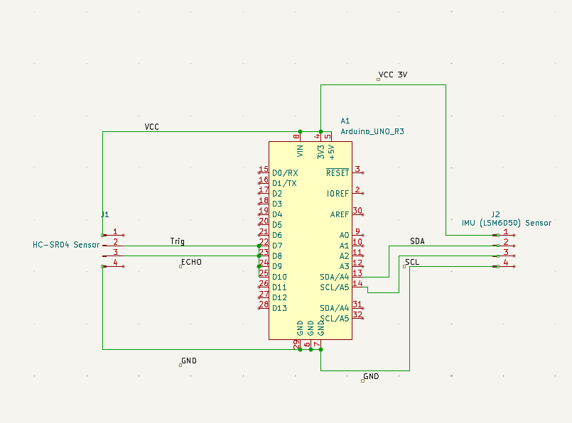

# CrashView

## Overview

Most electric vehicles (EVs) lack real‐time situational awareness tools that help drivers and engineers interpret motion and proximity risks while a vehicle is operating. CrashView is a lightweight, energy‐efficient edge device and companion UI that continuously fuses inertial
(LSM6DSO IMU) and ultrasonic ranging (HC‐SR04) to surface instant vehicle status, alerts, and health metrics. The Arduino‐based edge controller performs on‐device filtering and thresholding (e.g., abnormal yaw‐rate spikes, impact‐like acceleration, unsafe proximity) and
streams structured telemetry to a desktop dashboard for visualization. To conserve storage while retaining critical evidence, the system implements selective SD logging of short pre/post windows around flagged events. This work demonstrates how low‐cost hardware and efficient
edge processing can provide actionable, real‐time insight for safer EV and robotic platforms.

## Authors

- **Professor Weisong Shi** - weisong@udel.edu
- **Graduate Student Yuxin Wang** - yuxw@udel.edu  
- **Undergraduate Student Shaurya Kumar** - shaurya@udel.edu
- **Undergraduate Student Chinmay Agrawal** - cagrawal@udel.edu

## Features

- **Real-time Crash Detection**: Monitors vehicle movement using multiple sensor inputs
- **Multi-sensor Fusion**: Combines gyroscope, accelerometer, and ultrasound data for accurate detection
- **Threshold-based Analysis**: Uses intelligent algorithms to determine crash events
- **Dashboard UI**: CrashView interface for real-time monitoring and data visualization
- **Data Logging**: Comprehensive recording of sensor data and crash events

## Demo

[](https://raw.githubusercontent.com/ShauryaKumarr/CrashView/main/demo_CrashView.mp4)


## Hardware Diagram



## System Architecture

The AutoRec system consists of several key components:

1. **Arduino-based Sensor Hub**: Collects data from gyroscope, accelerometer, and ultrasound sensors
2. **Python Backend**: Processes sensor data and implements crash detection algorithms
3. **React Dashboard**: CrashView interface for real-time monitoring and visualization
4. **Data Analysis Tools**: Python scripts for data processing and visualization

## Required Python Libraries

Based on the project requirements, the following Python libraries are necessary:

```python
# Core libraries for the crash detection system
flask                    # Web framework for the backend server
serial                  # Serial communication with Arduino
threading               # Multi-threading for concurrent operations
time                    # Time-based operations and delays
json                    # JSON data handling
re                      # Regular expressions for data parsing
numpy                   # Numerical computing and array operations
pandas                  # Data manipulation and analysis
matplotlib              # Data visualization and plotting
seaborn                 # Statistical data visualization
scikit-learn            # Machine learning algorithms (if needed)
```

## How to Recreate the Project

### Prerequisites

- Arduino IDE
- Python 3.7+
- Node.js and npm (for React dashboard)
- Required hardware components (see hardware diagram)

### Setup Instructions

#### 1. Arduino Setup

1. Connect the sensors to your Arduino board according to the hardware diagram
2. Upload the `gyro_accel_arduino.ino` sketch to your Arduino
3. Ensure proper serial communication between Arduino and computer

#### 2. Python Backend Setup

1. Create a virtual environment:
   ```bash
   python -m venv venv
   source venv/bin/activate  # On Windows: venv\Scripts\activate
   ```

2. Install required Python packages:
   ```bash
   pip install flask serial numpy pandas matplotlib seaborn scikit-learn
   ```

3. Run the serial SSE server:
   ```bash
   python serial_sse_server.py
   ```

#### 3. React Dashboard Setup

1. Navigate to the desktop app directory:
   ```bash
   cd desktop_app
   ```

2. Install dependencies:
   ```bash
   npm install
   ```

3. Start the development server:
   ```bash
   npm start
   ```

#### 4. Data Analysis Tools

The project includes several Python scripts for data analysis and visualization:
- `imu_data_analysis.py`: IMU sensor data analysis
- `crash_detection.py`: Crash detection algorithms
- `visualize_data.py`: Data visualization tools
- `clean_data.py`: Data preprocessing utilities

## Project Structure

```
AutoRec/
├── arduino/                    # Arduino code and serial communication
├── data visuals & simulations/ # Generated visualizations and simulations
├── desktop_app/               # React-based CrashView dashboard
├── old programs/              # Legacy Python scripts and utilities
└── README.md                  # This file
```

## Contributing

This project was developed as part of academic research at the University of Delaware. For questions or collaboration opportunities, please contact the authors listed above.

## License

This project is developed for academic research purposes. Please contact the authors for usage permissions and licensing information.
